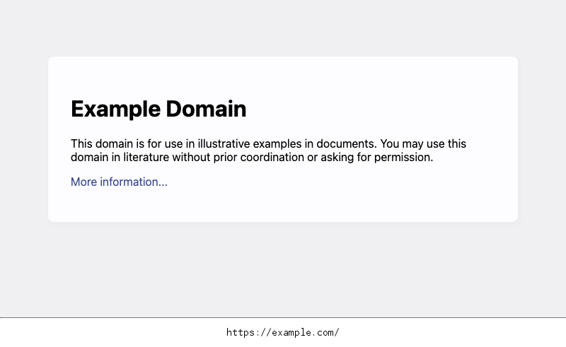

<p align="center">

</p>

<div align="center">
A tool used for capturing screenshots of web pages. Uses <a href="https://github.com/go-rod/rod">Rod</a> for headless browsing.
</div>

## Features

- Stream URLs from standard input.
- Set a wait time before capturing.
- Follow or ignore redirects.
- Save only unique screenshots.
- Handle multiple requests at once.
- Ignore SSL certificate errors.
- Disable HTTP/2 if needed.
- Use a custom user-agent.
- Option to include URL in images.

## Installation

### Go

```
go install github.com/root4loot/screener/cmd/screener@latest
```

### Docker

```
git clone https://github.com/root4loot/screener.git
cd screener
docker run --rm -it $(docker build -q .) -t example.com
```

## Usage

```
Usage: screener [options] (-t <target> | -l <targets.txt>)

INPUT:
  -t, --target                   single target
  -l, --list                     input file containing list of targets (one per line)

CONFIGURATIONS:
  -c,   --concurrency            number of concurrent requests               (Default: 10)
  -to,  --timeout                timeout for screenshot capture              (Default: 15 seconds)
  -ua,  --user-agent             set user agent                              (Default: Chrome Headless)
  -su,  --save-unique            save unique screenshots only                (Default: false)
  -dh,  --use-http2              use HTTP2                                   (Default: false)
  -fr,  --follow-redirects       follow redirects                            (Default: true)
  -cw,  --capture-width          screenshot pixel width                      (Default: 1366)
  -ch,  --capture-height         screenshot pixel height                     (Default: 768)
  -cf,  --capture-full           capture full page                           (Default: false)
  -fw,  --fixed-wait             fixed wait time before capturing (seconds)  (Default: 2)
  -dc,  --delay-between-capture  delay between capture (seconds)             (Default: 0)
  -ice, --ignore-cert-err        ignore certificate errors                   (Default: true)
  -isc, --ignore-status-codes    ignore HTTP status codes (comma separated)  (Default: false)
  -s,   --silence                silence output                              (Default: false)

OUTPUT:
  -o,   --outfolder              save images to given folder                 (Default: ./screenshots)
  -nu,  --no-url                 do not imprint URL in image                 (Default: false)
  -s,   --silence                silence output
  -v,   --verbose                verbose output
        --version                display version

```

## Example

### Screenshot Single Target

Capture a single target. If the scheme (http/https) is not specified, then it will default to https and fallback to http if the former fails.

```sh
$ screener -t "example.com"
[screener] (INF) Preparing screenshot: https://example.com
[screener] (RES) Successful screenshot: https://example.com/
```

### Screenshot Multiple Targets

Capture multiple targets.

```sh
$ cat targets.txt
142.250.74.110
google.com
bugcrowd.com
hackerone.com/sitemap.xml
http://example.com
https://scanme.sh
```

Note that targets can be IP, domain, or full URL.

```sh
$ screener -l targets.txt
[screener] (RES) Saved screenshot to screenshots/http_example.com.png
[screener] (RES) Saved screenshot to screenshots/https_hackerone.com_sitemap.xml.png
[screener] (RES) Saved screenshot to screenshots/https_scanme.sh.png
[screener] (RES) Saved screenshot to screenshots/https_142.250.74.110.png
[screener] (RES) Saved screenshot to screenshots/https_google.com.png
[screener] (RES) Saved screenshot to screenshots/https_bugcrowd.com.png
```

You may also "stream" targets to screener, capturing screenshots as they are received:

```sh
$ cat targets.txt | screener
[screener] (RES) Saved screenshot to screenshots/https_142.250.74.110.png
[screener] (RES) Saved screenshot to screenshots/https_google.com.png
[screener] (RES) Saved screenshot to screenshots/https_bugcrowd.com.png
[screener] (RES) Saved screenshot to screenshots/https_hackerone.com_sitemap.xml.png
[screener] (RES) Saved screenshot to screenshots/http_example.com.png
[screener] (RES) Saved screenshot to screenshots/https_scanme.sh.png
```

When dealing with many same-site URLs, use the `-su` or `--save-unique` flags to avoid saving multiple copies of the same screenshot. This makes it easier to sort through your screenshots!
In the following example, we're using [recrawl](https://github.com/root4loot/recrawl) to crawl a target site and pipe its results to screener with the `--save-unique` flag set. For more information, see [recrawl](https://github.com/root4loot/recrawl).

```sh
$ recrawl --target "hackerone.com" --hide-status --hide-media | screener --save-unique
[recrawl] (INF) Hiding status codes: true
[recrawl] (INF) Hiding media: [.png .jpg .jpeg .woff .woff2 .ttf .eot .svg .gif .ico .webp .mp4 .webm .mp3 .wav .flac .aac .ogg .m4a .flv .avi .mov .wmv .swf .mkv .m4v .3gp .3g2]
[recrawl] (INF) Notice: Output is being piped. 'Result' logs will be formatted accordingly.
[recrawl] (INF) Crawling target: https://hackerone.com

[screener] (INF) Skipping duplicate screenshot for https://hackerone.com/robots.txt
[screener] (RES) Saved screenshot to screenshots/https_hackerone.com_robots.txt.png
[screener] (INF) Skipping duplicate screenshot for https://www.hackerone.com/node/12420/
[screener] (RES) Saved screenshot to screenshots/https_www.hackerone.com_node_12420.png
[screener] (INF) Skipping duplicate screenshot for https://www.hackerone.com/product/challenge/
[screener] (RES) Saved screenshot to screenshots/https_www.hackerone.com_product_challenge.png
[screener] (INF) Skipping duplicate screenshot for https://www.hackerone.com/node/9916/
[screener] (RES) Saved screenshot to screenshots/https_www.hackerone.com_node_9916.png
...
```

## Example Screenshot

<p align="center">

</p>

## Tips

- Use `-nu` or `--no-url` flag to remove the URL from the image.
- Use `-su` or `--save-unique` flag to save only screenshots that are unique.
- macOS users can quickly access websites from screenshots: Press `Space` to preview an image, then mouse over the URL imprinted at the bottom. You can often click the link directly with `Command` + `Click`. If this method doesn't work, open the image in the Preview app to click the URL.

## Library Example 📦

```
go get github.com/root4loot/screener
```

```go
package main

import (
	"fmt"

	"github.com/root4loot/screener"
)

func main() {
	// Create runner with default options
	runner := screener.NewRunner()
	runner.Options.SaveScreenshots = true

	// Capture a single URL
	result := runner.Run("https://example.com", "https://hackerone.com")

	// Process the result
	for _, result := range result {
		fmt.Println(result.TargetURL, result.LandingURL, result.Error, len(result.Image))
	}
}

```

For more, see [examples](https://github.com/root4loot/screener/tree/master/examples)

## License

See [LICENSE](LICENSE)

## Contributing

See [CONTRIBUTING.md](CONTRIBUTING.md)
