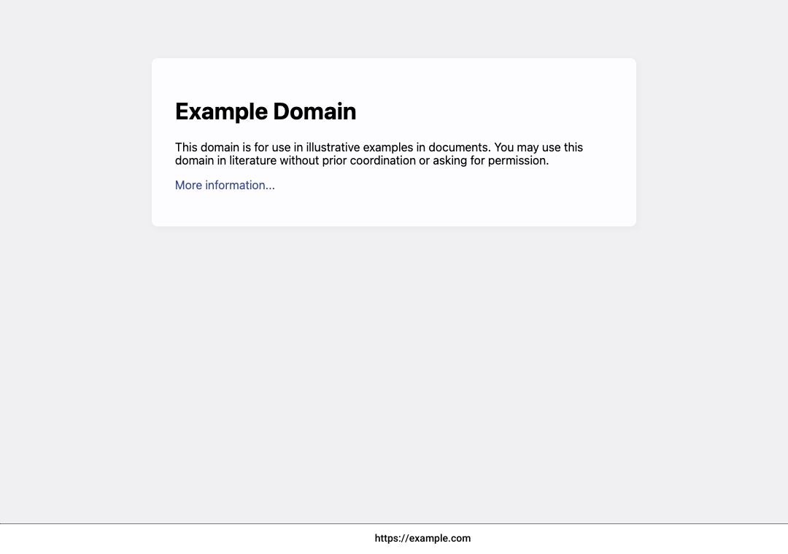

<p align="center">
  
</p>

<div align="center">
  A tool to capture screenshots of web pages using <a href="https://github.com/go-rod/rod">Rod</a> for headless browsing.
</div>

<br>

<div align="center">
  <a href="https://github.com/root4loot/screener/actions/workflows/build.yml">
    
  </a>
  
</div>

## Features

- Stream URLs from input.
- Wait before capturing.
- Follow or skip redirects.
- Save unique screenshots only.
- Handle many requests at once.
- Ignore SSL errors.
- Turn off HTTP/2 if needed.
- Use a custom user agent.
- Add URL to images.
- Also screenshot 4xx/5xx error pages

## Installation

### Go

```
go install github.com/root4loot/screener/cmd/screener@latest
```

### Docker

```
git clone https://github.com/root4loot/screener.git
cd screener
docker run --rm -it $(docker build -q .) -t example.com
```

## Usage

```
USAGE:
  screener [options] (-t <target> | -l <targets.txt>)

INPUT:
  -t, --target                   target input (domain, IP, URL)
  -l, --list                     input file with list of targets (one per line)

CONFIGURATIONS:
  -c,   --concurrency            number of concurrent operations                         (Default: 10)
  -ad,  --avoid-duplicates       prevent saving duplicate outputs                        (Default: false)
  -dt,  --duplicate-threshold    threshold for similarity percentage (0-100)             (Default: 96)
                                 Applicable only when --avoid-duplicates is enabled. Outputs
                                 with a similarity score greater than or equal to this value
                                 will be considered duplicates and will not be saved.
  -to,  --timeout                screenshot timeout                                      (Default: 15 seconds)
  -ua,  --user-agent             specify user agent                                      (Default: Chrome UA)
  -uh,  --use-http2              use HTTP2                                               (Default: false)
  -nr,  --ignore-redirects       do not follow redirects                                 (Default: false)
  -cw,  --capture-width          output width                                            (Default: 1366)
  -ch,  --capture-height         output height                                           (Default: 768)
  -cf,  --capture-full           capture entire content                                  (Default: false)
  -dc,  --delay-capture          delay before operation (seconds)                        (Default: 2)
  -dbc, --delay-between-capture  delay between operations (seconds)                      (Default: 0)
  -rce, --respect-cert-err       respect certificate errors                              (Default: false)
  -isc, --ignore-status-codes    ignore specific status codes (comma separated)          (Default: 204, 301, 302, 304, 401, 407)

OUTPUT:
  -o,   --outfolder              save outputs to specified folder                        (Default: ./screenshots)
  -nt,  --no-text                do not add text to output images                        (Default: false)
        --debug                  enable debug mode
        --version                display version
```

## Example

### Single Target

Capture a single target. If you don't specify http or https, it defaults to https and tries http if https fails.

```sh
$ screener -t example.com
[screener] (INF) Screenshot saved to screenshots/https_example.com.png
```

### Multiple Targets

Capture multiple targets.

```sh
$ cat targets.txt
142.250.74.110
google.com
bugcrowd.com
hackerone.com/sitemap.xml
http://example.com
https://scanme.sh
```

Note that targets can be IP, domain, or full URL.

```sh
$ screener -l targets.txt
[screener] (RES) Screenshot saved to screenshots/http_example.com.png
[screener] (RES) Screenshot saved to screenshots/https_hackerone.com_sitemap.xml.png
[screener] (RES) Screenshot saved to screenshots/https_scanme.sh.png
[screener] (RES) Screenshot saved to screenshots/https_142.250.74.110.png
[screener] (RES) Screenshot saved to screenshots/https_google.com.png
[screener] (RES) Screenshot saved to screenshots/https_bugcrowd.com.png
```

You may also "stream" targets to screener, capturing screenshots as they are received:

```sh
$ cat targets.txt | screener
[screener] (RES) Screenshot saved to screenshots/https_142.250.74.110.png
[screener] (RES) Screenshot saved to screenshots/https_google.com.png
[screener] (RES) Screenshot saved to screenshots/https_bugcrowd.com.png
[screener] (RES) Screenshot saved to screenshots/https_hackerone.com_sitemap.xml.png
[screener] (RES) Screenshot saved to screenshots/http_example.com.png
[screener] (RES) Screenshot saved to screenshots/https_scanme.sh.png
```

When dealing with many same-site URLs, use the `-su` or `--save-unique` flags to avoid saving multiple copies of the same screenshot. This makes it easier to sort through your screenshots!
In the following example, we're using [recrawl](https://github.com/root4loot/recrawl) to crawl a target site and pipe its results to screener with the `--save-unique` flag set. For more information, see [recrawl](https://github.com/root4loot/recrawl).

```sh
$ recrawl --target "hackerone.com" --hide-status --hide-media | screener --avoid-duplicates
[recrawl] (RES) Hiding status code from output
[recrawl] (RES) Excluding media [.png .jpg .jpeg .woff .woff2 .ttf .eot .svg .gif .ico .webp .mp4 .webm .mp3 .wav .flac .aac .ogg .m4a .flv .avi .mov .wmv .swf .mkv .m4v .3gp .3g2]
[recrawl] (RES) Notice: Output is being piped. Results will be formatted accordingly.
[screener] (RES) Screenshot saved to screenshots/https_hackerone.com_robots.txt.png
[screener] (RES) Screenshot saved to screenshots/https_www.hackerone.com.png
[screener] (RES) Screenshot saved to screenshots/https_hackerone.com.png
[screener] (RES) Screenshot saved to screenshots/https_hackerone.com_assets_static_main_js-DsnehVnn.css.png
[screener] (RES) Screenshot saved to screenshots/https_hackerone.com_hacktivity_overview.png
[screener] (RES) Screenshot saved to screenshots/https_hackerone.com_leaderboard_all-time.png
[screener] (RES) Screenshot saved to screenshots/https_hackerone.com_users_sign_in.png
[screener] (RES) Screenshot saved to screenshots/https_hackerone.com_leaderboard.png
[screener] (RES) Screenshot saved to screenshots/https_hackerone.com_opportunities_all_search.png
[screener] (RES) Screenshot saved to screenshots/https_hackerone.com_assets_static_main_js-BQGA2x_6.js.png
[screener] (RES) Screenshot saved to screenshots/https_hackerone.com_assets_constants-06feb5198be5bd0ee51e0df3fedfd6d8ff1605a0e97a34becc0ec8615eda2e26.js.png
[screener] (RES) Screenshot saved to screenshots/https_hackerone.com_assets_static_main_css-B6Ng0SnZ.css.png
[screener] (RES) Screenshot saved to screenshots/https_hackerone.com_assets_static_pages-06310525d168da11de8f7941d231b4cae41abc6c58c72e6b4449e78fbfcb628e.css.png
...
```

## Example Screenshot

<p align="center">

</p>

## Tips

- Use `-nu` or `--no-url` flag to remove the URL from the image.
- Use `-ad` or `--avoid-duplicates` flag to prevent duplicate images from being saved.
- macOS users can quickly access websites from screenshots: Press `Space` to preview an image, then mouse over the URL imprinted at the bottom. You can often click the link directly with `Command` + `Click`. If this method doesn't work, open the image in the Preview app to click the URL.

## Library Example

```
go get github.com/root4loot/screener/pkg/screener
```

```go
package main

import (
	"fmt"
	"net/url"

	"github.com/root4loot/goutils/urlutil"
	"github.com/root4loot/screener/pkg/screener"
)

func main() {
	options := screener.NewOptions()
	options.CaptureWidth = 1024
	options.CaptureHeight = 768
	// more options ...

	s := screener.NewScreenerWithOptions(options)

	urls := []string{
		"https://example.com",
		"https://example.org",
		"https://scanme.sh",
	}

	var results []screener.Result

	for _, u := range urls {
		parsedURL, err := url.Parse(u)
		if err != nil {
			fmt.Printf("Error parsing URL %s: %v\n", u, err)
			continue
		}

		// Capture screenshot
		result, err := s.CaptureScreenshot(parsedURL)
		if err != nil {
			fmt.Printf("Error capturing screenshot for %s: %v\n", u, err)
			continue
		}

		// Check for duplicates
		if result.IsSimilarToAny(results, 96) { // 96% similarity
			fmt.Printf("Screenshot for %s is a duplicate, skipping\n", u)
			continue
		}

		// Add text to image
		origin, err := urlutil.GetOrigin(result.TargetURL)
		if err != nil {
			fmt.Printf("Error getting origin for %s: %v", result.TargetURL, err)
			return
		}

		result.Image, err = result.Image.AddTextToImage(origin)
		if err != nil {
			fmt.Printf("Error adding text to image for %s: %v\n", u, err)
			continue
		}

		// Save image to file
		filename, err := result.SaveImageToFolder("./screenshots")
		if err != nil {
			fmt.Printf("Error saving screenshot for %s: %v\n", u, err)
			continue
		}

		fmt.Printf("Screenshot saved to %s\n", filename)
		results = append(results, *result)
	}
}

```

For more, see [examples](https://github.com/root4loot/screener/tree/master/examples)

## License

See [LICENSE](LICENSE)

## Contributing

See [CONTRIBUTING.md](CONTRIBUTING.md)
